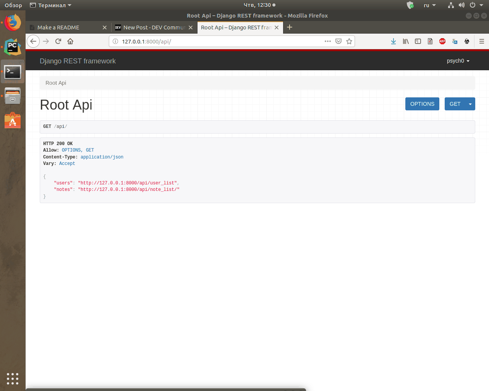

# vinecode
tasting notes

#Install dependency
```bash
pip install -r requirements.txt
```
#Make migrate
```bash
python manage.py makemigrations
python manage.py migrate
```
#Run
```bash
python manage.py runserver
```
# Presentation

